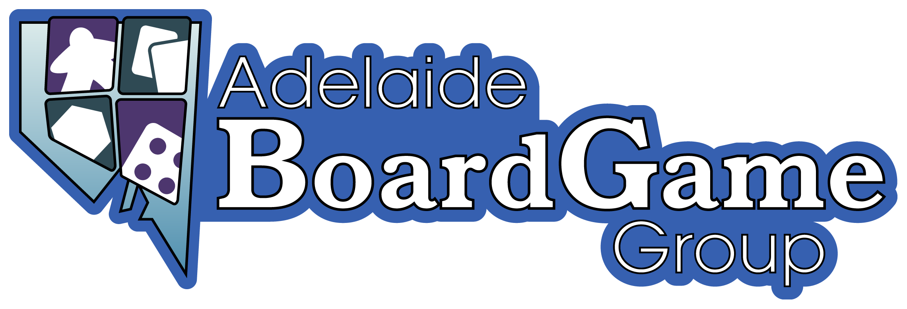

# Quick Connect
Welcome, these are some pages to help the ABGG community find, and attend our events.  
We mostly organise our events via Facebook, and cross-post event info to Discord, so we suggest connecting with us on one of those platforms!
Use the links below to quickly find us across the Internet!

| [Facebook](https://facebook.com/groups/abgg2013)   | [BoardGameGeek](https://boardgamegeek.com/guild/331) | [Discord](https://discord.com/invite/cexhQBX) | [Board Game Arena](https://boardgamearena.com/group?id=3460147) |
|----------|----------|----------|----------|
|     |  |    |    |

# Event Calendar

We have a Google calendar available for all our upcoming events.

[Click this link to access the calendar.](https://calendar.google.com/calendar/embed?src=15cd857338d6a885773f1470e2ae5024da12186c9fe732ec0630444955bff6ea%40group.calendar.google.com&ctz=Australia%2FAdelaide)

# About Us

## Our Group

Adelaide Board Game Group (ABGG) is a community board gaming group run by a small group of volunteers.

Our goal is to promote board gaming as a hobby in South Australia, we want to help bring the golden age of board games to more people.

We host regular board game events, all open to the general public to join us, in a variety of venues around the state, at low, or no cost to attendees; and have a Facebook and Discord community to discuss the hobby.

At ABGG we to love and play all sorts of board games – at our events you can expect to see latest releases, tons of modern board games, as well as older favourites.  We welcome all gamers regardless of age, or experience.

## Discussion

Our Facebook and Discord communities are also a great place to meet, connect with, discuss, and arrange sessions of board games with other local gamers.

For those seeking a local group to play with these are a great place to do so.

* Our [Facebook](https://facebook.com/groups/abgg2013) page is the most active place to find us.

* Our [Discord Server](https://discord.com/invite/cexhQBX) is a great alternative for those who don't use Facebook.

## Other Platforms

You can find us in a variety of of other spots

* Those with a taste for online board gaming can find us on [Board Game Arena](https://boardgamearena.com/group?id=3460147). We also host an [online game night](online-games.md) using Discord.
* We've got a [guild on BoardGameGeek](https://boardgamegeek.com/guild/331)

## Events 

ABGG is responsible for hosting events, at various locations and times ("ABGG Events" - those organised by our volunteer team).

We also encourage those in the local community with goals aligned to ours to promote their board games, and occasional wider tabletop events here ("Community Events" - those created by locals and promoted here )

We aspire to keep ABGG events free where possible, or low cost for attendees, and our events are open for all to join us.

Most games are brought by attendees to create a pool of games to choose from and play.  ABGG also has several games provided by a variety of benefactors which will be present at events.

Because of this the games brought along to ABGG vary significantly - it really depends on who's bringing them!

People are also encouraged to post in the community about games they'd like to play (either BYO, or want someone to bring it) - we love to see people arrange getting a game they're passionate about to the table

# Photo gallery

To see some photos from our previous events you can [check out our photo gallery here](gallery.md)

# Information resources

## General

- Find out what to expect if you've never attended before, with the [first-timer guide](guides/firsttime.md)

- Essential reading for all -- [the previously unwritten courtesy guide](guides/courtesy.md)

- Finding us at Payneham can sometimes be a bit tricky, but no more with [our guide to getting to the Payneham events](guides/location-payneham.md)

## Our Events

Last updated: June 2025

### Event List

**Check out our [live list of events on Google calendar](https://calendar.google.com/calendar/embed?src=15cd857338d6a885773f1470e2ae5024da12186c9fe732ec0630444955bff6ea%40group.calendar.google.com&ctz=Australia%2FAdelaide) for the most up-to-date info**

#### ↖️ North-West Meetup @ Parks (Free)  
&nbsp;&nbsp;&nbsp;📅 Weekly Sessions on Monday  
&nbsp;&nbsp;&nbsp;🕔 5pm - 🕙 10pm  
&nbsp;&nbsp;&nbsp;🗺️ Parks Library, 46 Trafford Street, Angle Park  

#### 🎯 Central Meetup @ NACC (Donation Requested)
&nbsp;&nbsp;&nbsp;📅 Weekly Sessions on Tuesday  
&nbsp;&nbsp;&nbsp;🕠 5:30pm - 🕥 10:30pm  
&nbsp;&nbsp;&nbsp;🗺️ North Adelaide Community Centre (NACC), 176 Tynte Street, North Adelaide  

#### ↗️ North-East Meetup @ Payneham (Donation Requested)
&nbsp;&nbsp;&nbsp;📅 Weekly Sessions on Saturday  
&nbsp;&nbsp;&nbsp;🕐 1pm - 🕙 10pm  
&nbsp;&nbsp;&nbsp;🗺️ Payneham Community Centre, 374 Payneham Road, Payneham  

#### ⬇️ Southern Meetup @ Marion (Free)  
&nbsp;&nbsp;&nbsp;📅 Third Saturday of each month  
&nbsp;&nbsp;&nbsp;🕚 1pm - 🕕 7pm  
&nbsp;&nbsp;&nbsp;🗺️ Cooinda Neighbourhood Centre, 245 Sturt Rd, Sturt

#### 💻 Online Game Night   
&nbsp;&nbsp;&nbsp;📅 Fortnightly Sundays  
&nbsp;&nbsp;&nbsp;🕚 7pm - 🕕 10pm  
&nbsp;&nbsp;&nbsp;🗺️ Meet on Discord for games using Boardgame Arena. See our [online game night guide](online-games.md) for more details

# Feedback

These pages are living documents, created by ABGG volunteers

- Get in touch any way you know how (Facebook group is the most active) and let us know what you'd like to see here.

- The pages are hosted via GitHub pages -- if you have the technical know-how then feel free to create a new page, or update one, and submit a pull request with your changes to [the repo](https://github.com/Dislexsick/ABGG).
