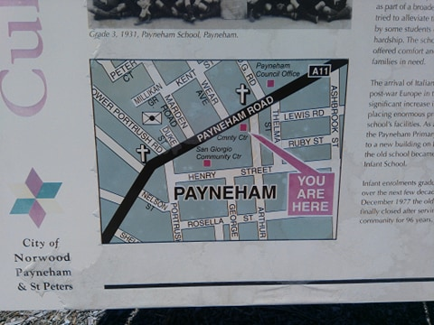
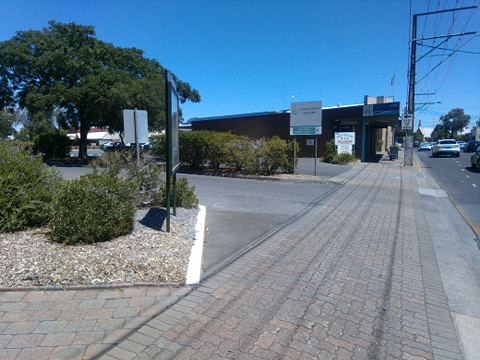
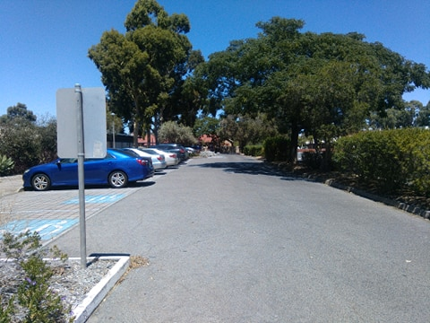
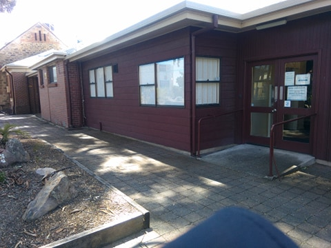
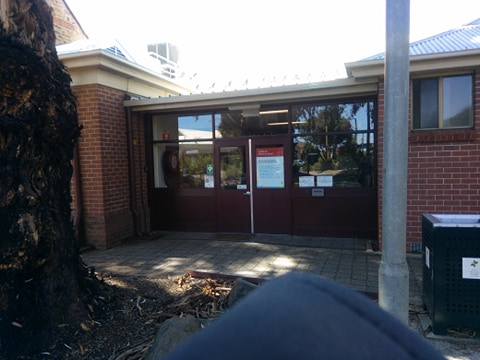
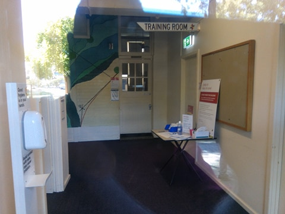

The site is the Payneham Community Centre 374 Payneham Rd, Payneham.
It is on the corner of Payneham Rd and Arthur St at Payneham

 
To Enter the carpark you must be traveling south west toward the city along Payneham Road.
You cannot enter the carpark any other way.
You pass the OG road intersection (OG is on your right/north). You then pass a small road, Arthur St on your left (south side) and then it’s the next driveway turn on your left, well prior to reaching the main intersection

Once you enter the car park the main building is on your left (east).
Park and come to the entry at the south end of the west side of the building (away from the road and facing car park).
Room One is straight in front of you.

 
Car Park Entry.

 
Entering car park.

 
 
This door for entry.

**Not** this door!

View through entry door of Room One entry.

